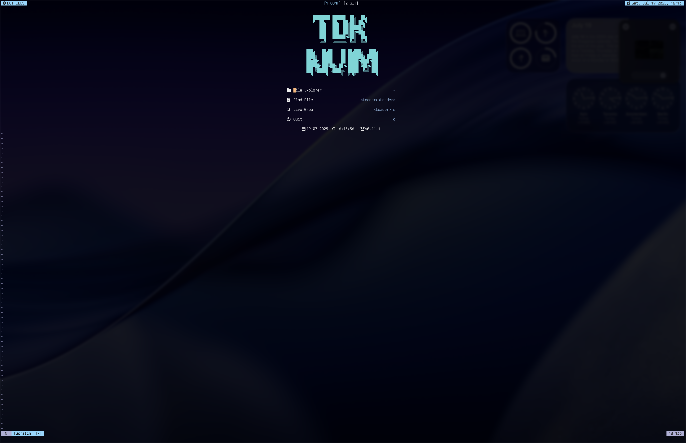
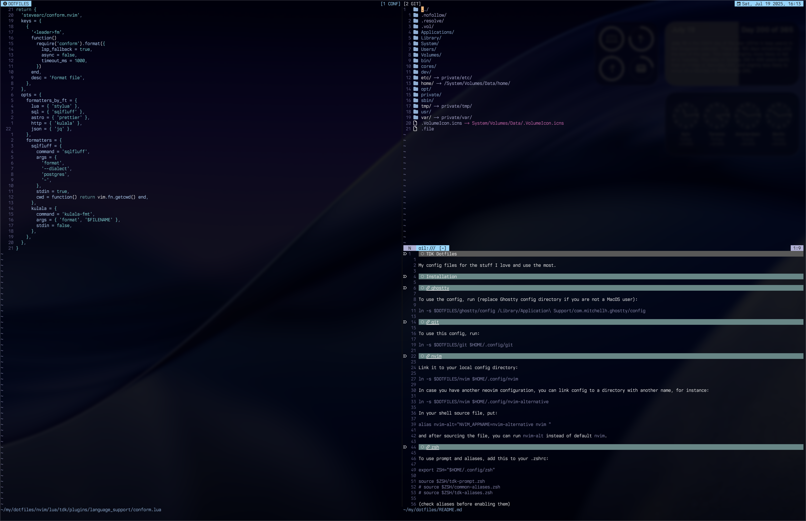
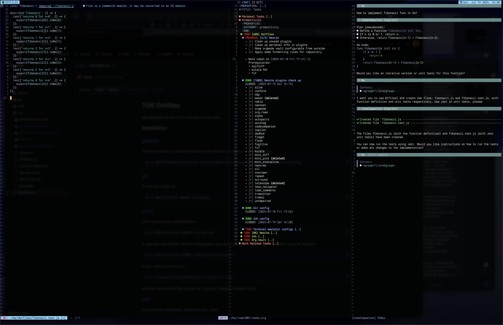
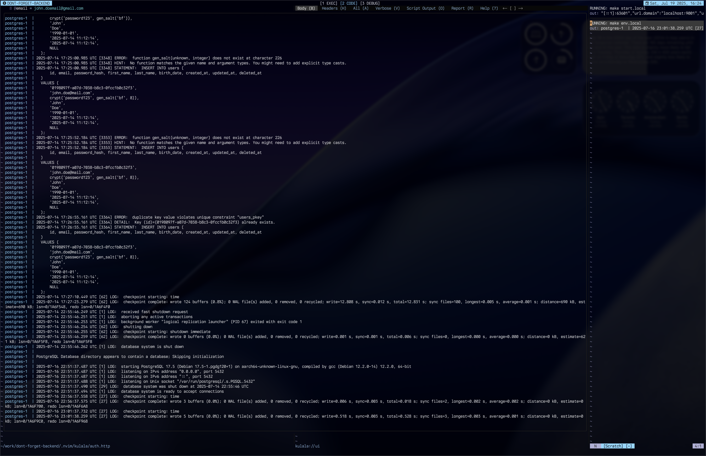
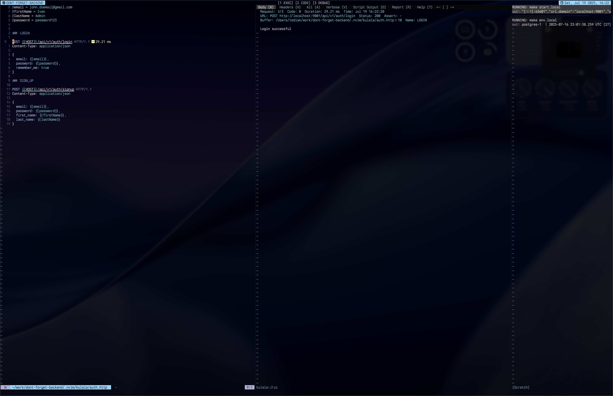

# TDK Dotfiles
My config files for the stuff I love and use the most.

## Installation

### [ghostty](./ghostty)
To use the config, run (replace Ghostty config directory if you are not a MacOS user):

```sh
ln -s $DOTFILES/ghostty/config "$HOME/Library/Application Support/com.mitchellh.ghostty/config"
```

### [git](./git)

To use this config, run:

```sh
ln -s $DOTFILES/git $HOME/.config/git
```

### [nvim](./nvim)

<details>
<summary>Screenshots</summary>







</details>

Link it to your local config directory:

```sh
ln -s $DOTFILES/nvim $HOME/.config/nvim
```

In case you have another neovim configuration, you can link config to a directory with another name, for instance:

```sh
ln -s $DOTFILES/nvim $HOME/.config/nvim-alternative
```

In your shell source file, put:

```sh
alias nvim-alt="NVIM_APPNAME=nvim-alternative nvim "
```

and after sourcing the file, you can run `nvim-alt` instead of default `nvim`.

### [tmux](./tmux)

Config is presented by [tmux](./tmux) directory with conf files and [script](./tmux-sessionizer.zsh) for quick switching between tmux sessions. To use config, run:

```sh
sudo cp $DOTFILES/tmux-sessionizer.zsh /usr/local/bin/ss
ln -s $DOTFILES/tmux $HOME/.config/tmux
```

> ⚠️ Warning: Check out line 16 of the [script](./tmux-sessionizer.zsh), you probably want to adapt directories used in find command.

### [zsh](./zsh)

1. Install [oh-my-posh](https://ohmyposh.dev/docs/installation/linux#installation)
2. Link a config directory:

```sh
ln -s $DOTFILES/zsh $HOME/.config/zsh
```

To use prompt and aliases, add this to your .zshrc:

```sh
export ZSH="$HOME/.config/zsh"

source $ZSH/tdk-prompt.zsh
# source $ZSH/common-aliases.zsh
# source $ZSH/tdk-aliases.zsh
```

> ⚠️ Warning: check aliases before enabling them

